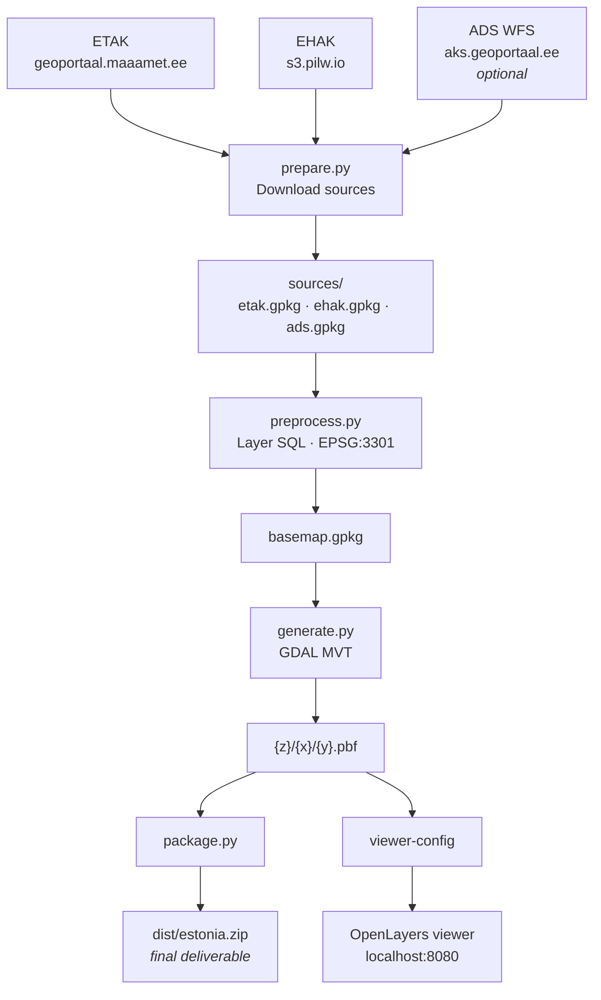

# Estonia EPSG:3301 Python GDAL pipeline

This repo is the GDAL-only vector tile pipeline for Estonia in EPSG:3301 (L-EST97).
Python owns the data download, preprocessing layer mapping, classifier SQL, and tile
settings. GDAL still does the heavy geospatial work through CLI subprocesses.

The Web Mercator counterpart (EPSG:3857, Planetiler + Martin) lives in
[sanderpukk/vectortile_3857](https://github.com/sanderpukk/vectortile_3857).

## Architecture



## Layout

| Path | Purpose |
| --- | --- |
| `config/settings.py` | User-editable tile grid, zoom, mode, and layer mapping settings |
| `src/vt_pipeline/prepare.py` | Downloads ETAK and EHAK sources |
| `src/vt_pipeline/layers.py` | OMT-like preprocessing layer definitions and classification SQL |
| `src/vt_pipeline/preprocess.py` | Builds `basemap.gpkg` from the raw source GeoPackages |
| `src/vt_pipeline/generate.py` | Runs GDAL MVT tile generation |
| `src/vt_pipeline/viewer.py` | Generates browser viewer config from the same Python settings |
| `viewer/` | OpenLayers viewer served by nginx |

## Run with Docker Compose

From PowerShell (run from the repo root):

```powershell
docker compose run --rm pipeline
docker compose run --rm package
docker compose up viewer
```

`package` zips the generated tiles into the final datapackage at
`dist\estonia.zip` (or `dist\tallinn.zip` for the Tallinn prototype) on the host.
This zip is the main product of the pipeline: the tile tree with `{z}/{x}/{y}.pbf`
and `metadata.json` at the zip root, entries stored uncompressed because the pbf
tiles are already gzipped.

On the first run, Docker may appear to pause after creating the network while it
pulls and extracts the large GDAL base image. To see those Docker build logs,
build the image explicitly first:

```powershell
docker compose --progress=plain build pipeline
docker compose run --rm pipeline
```

This Docker Compose version does not support `docker compose run --no-build`.
After the explicit build, a normal `docker compose run --rm pipeline` reuses the
cached image and should start the Python timestamp logs quickly.

Open:

```text
http://localhost:8080
```

By default `pipeline` builds the full Estonia tile set. It runs:

1. `prepare` - download ETAK/EHAK source data (plus optional ADS, see below).
2. `preprocess` - build `/data/basemap.gpkg`.
3. `generate` - create vector tiles in `/out/estonia`.
4. `viewer-config` - update `viewer/config.js`.

Run `docker compose run --rm package` afterwards to build the datapackage zip
in `dist\` on the host. The viewer opens the Estonia source by default.

For the faster Tallinn prototype (optional), set `MODE=tallinn`:

```powershell
$env:MODE = "tallinn"
docker compose run --rm pipeline
docker compose up viewer
```

In bash-compatible shells, the equivalent is:

```bash
MODE=tallinn docker compose run --rm pipeline
docker compose up viewer
```

Open the Tallinn prototype tile source explicitly with:

```text
http://localhost:8080/?src=tallinn
```

## Optional ADS source

The ADS layers (unofficial city districts, `asum` neighbourhoods and small
places) come from the AKS WFS at `aks.geoportaal.ee` and feed only the secondary
`place_detail` label layer. They are optional, so the build does not depend on
that service being available:

- **Skip explicitly:** set `SKIP_ADS=1` on `prepare` / `data-prep` / `pipeline`
  to skip the ADS download entirely. Use this when the AKS WFS is down or slow.
- **Automatic fallback:** if ADS is not skipped but the download fails, the error
  is downgraded to a warning and the build continues without it.
- **Effect:** when ADS is absent, `preprocess` skips the ADS-based layer and
  `place_detail` labels are omitted. Everything else is unaffected - roads,
  water, landcover, buildings, main place labels, and **house numbers** (which
  come from the ETAK building layer, not ADS).

```powershell
# Full Estonia build without ADS
docker compose run --rm -e SKIP_ADS=1 pipeline

# Or just the download step
docker compose run --rm -e SKIP_ADS=1 data-prep
```

In bash-compatible shells, use `SKIP_ADS=1 docker compose run --rm pipeline`.

To add the district labels later, once the WFS is back, fetch ADS and rebuild the
affected steps:

```powershell
docker compose run --rm data-prep    # fetch ADS (no SKIP_ADS)
docker run --rm -v vt-3301-python_vt_data:/data alpine rm -f /data/basemap.gpkg
docker compose run --rm preprocess
docker compose run --rm generate
```

## Timing and progress

There are two kinds of logs:

- Docker build logs: image pull/extract/build output. Use
  `docker compose --progress=plain build pipeline` to see these.
- Pipeline logs: Python/GDAL runtime output. These start after the image is
  built and the container begins running.

The `pipeline` command logs lightweight UTC timestamps for each major step and
prints the total elapsed time at the end:

```text
[2026-07-05 12:00:00 UTC] START total pipeline
[2026-07-05 12:00:00 UTC] START prepare
...
[2026-07-05 14:12:09 UTC] END total pipeline (2h 12m 9s)
```

GDAL still prints its own tile-generation progress during `generate`. The timing
wrapper only logs step boundaries, so it should not meaningfully affect build
performance.

During source downloads, the pipeline prints when a file starts and when it
finishes. It does not currently print byte-by-byte download progress, so a large
ETAK download can be quiet for a while.

If you run steps separately, each command reports only its own elapsed time. Use
`pipeline` when you want one total for the whole process.

## Run steps separately

You can also run each step separately:

```powershell
docker compose run --rm data-prep                 # add -e SKIP_ADS=1 to skip ADS
docker compose run --rm preprocess
docker compose run --rm generate
docker compose run --rm package
docker compose run --rm viewer-config
docker compose up viewer
```

The steps above default to full Estonia. For the Tallinn prototype instead:

```powershell
$env:MODE = "tallinn"
docker compose run --rm generate
docker compose run --rm package
docker compose run --rm viewer-config
```

## Outputs

The Docker Compose volumes hold the generated data:

| Output | Location in containers | Description |
| --- | --- | --- |
| Source data | `/data/sources/etak.gpkg`, `/data/sources/ehak.gpkg`, `/data/sources/ads.gpkg` (optional) | Downloaded/prepared source GeoPackages; `ads.gpkg` absent when ADS is skipped |
| Preprocessed map | `/data/basemap.gpkg` | OMT-like render layers in EPSG:3301 |
| Full Estonia tiles | `/out/estonia/{z}/{x}/{y}.pbf` | Full-country tile set (default) |
| Tallinn tiles | `/out/tallinn/{z}/{x}/{y}.pbf` | Optional fast prototype tile set |
| Datapackage | `dist\estonia.zip` (default), `dist\tallinn.zip` (host) | Zipped tile tree - the final deliverable |
| Viewer config | `viewer/config.js` | Browser tile grid/source config generated from Python settings |

Existing outputs are skipped. To rebuild a step, delete that output from the
volume or use a fresh Compose project/volume.

## Local Python commands inside the image

The compose services call these commands:

```bash
python3 -m vt_pipeline prepare
python3 -m vt_pipeline preprocess
python3 -m vt_pipeline generate --mode estonia
python3 -m vt_pipeline package --mode estonia
python3 -m vt_pipeline config-json
python3 -m vt_pipeline viewer-config --output viewer/config.js
python3 -m vt_pipeline run-all --mode estonia
python3 -m vt_pipeline run-all --mode tallinn
```

`config-json` prints the GDAL MVT `CONF` JSON generated from
`config/settings.py`. You normally edit the Python settings file, not the
generated JSON.

`viewer-config` writes `viewer/config.js`, which gives the browser the EPSG:3301
tile grid and tile source URLs from the same Python settings.

## Notes

- All preprocessing and tiling stays in EPSG:3301.
- Layer SQL is intentionally close to the original bash pipeline so the output
  remains comparable.
- `config/settings.py` is the user-facing config. GDAL JSON and viewer JS are
  generated from it.
- This repo produces PBF tiles in a zip archive (EPSG:3301). The Web Mercator
  counterpart using Planetiler + PMTiles is at
  [sanderpukk/vectortile_3857](https://github.com/sanderpukk/vectortile_3857).
